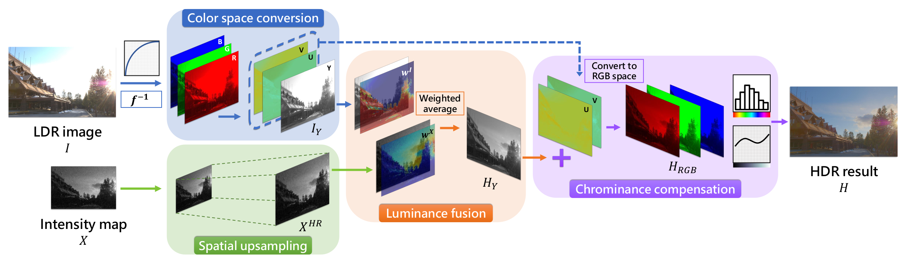
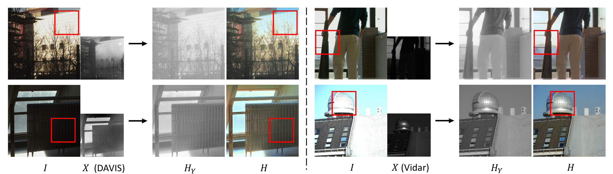

# NeurImg-HDR
## Introduction

This repo contains the code and dataset for **Hybrid High Dynamic Range Imaging fusing Neuromorphic and Conventional Images** (TPAMI 2023 [[Paper](https://drive.google.com/file/d/1gfdc9axSIHO3OOIXL6yTCGljj1l54gqO/view?usp=sharing)]), which is extended from **Neuromorphic Camera Guided High Dynamic Range Imaging** (CVPR 2020 [[Paper](https://openaccess.thecvf.com/content_CVPR_2020/papers/Han_Neuromorphic_Camera_Guided_High_Dynamic_Range_Imaging_CVPR_2020_paper.pdf)]).


### Pipeline
The conceptual pipeline of NeurImg-HDR fusion process consists of four steps: color space conversion of the LDR image, spatial upsampling of the intensity map, luminance fusion to produce HDR image in luminance domain, and chrominance compensation that refills the color information to get a colorful HDR result.


### Results


## Code
### Environment

We use `python 3.7.9` and `pytorch 1.11.0` for our code, the other dependencies are listed in the `./requirements.txt` file.

### Pretrained models

Please download the pretrained models from the following link, and uncompress it into `./checkpoints` folder.
[[Google Drive](https://drive.google.com/file/d/1rexQxWZQ24fNa9I5btUSmvvsAm8VCXor/view?usp=share_link)] (430.9 MB in total)

### Training
We apply phase-to-phase training strategy to train the Luminance Fusion Network (trained on images solely) and the Chrominance Compensation Network (trained on images and videos respectively). 

To train the Luminance Fusion Network on images, run the following command:
```
python train.py --dataroot ./datasets/your_image_dataset --name training_LFN --model lfn  --dataset_mode trainimage --loss_type l1+perc
```
Put the pretrained Luminance Fusion Network `luminance_fusion_net.pth` in `./checkpoints/pretrained_lfn_dir/` folder. Then train the Chrominance Compensation Network.

To train the Chrominance Compensation Network on images, run the following command:
```
python train.py --dataroot ./datasets/your_image_dataset --name training_on_images --model image  --dataset_mode trainimage --netColor image --loss_type l1+perc+gan --pretrained_lfn ./checkpoints/pretrained_lfn_dir
```

To train the Chrominance Compensation Network on videos, run the following command:
```
python train.py --dataroot ./datasets/your_video_dataset  --name training_on_videos --model video --dataset_mode trainvideo --netColor video  --loss_type l1+perc --pretrained_lfn ./checkpoints/pretrained_lfn_dir
```

### Inference

To test on images, run the following command:
```
python test.py --dataroot ./datasets/image_dataset --im_type spike --dataset_mode test  --model image --name image --netColor image
```

To test on spike-based videos, run the following command:
```
python test.py --dataroot ./datasets/spike_video_dataset --im_type spike --dataset_mode test --model video --name spike_video --netColor video
```

To test on event-based videos, run the following command:
```
python test.py --dataroot ./datasets/event_video_dataset/ --im_type event --dataset_mode test --model video --name event_video --netColor video --state_nc 32
```


### Tone mapping

First, you should install Luminance-HDR-CLI by this command: `apt-get install luminance-hdr`.
Then, you can run `./reinhard_tonamap.py` to get 8-bit tonemapped HDR images from $.exr$ files using the following command ($e.g.$, for spike-based video):
```
python reinhard_tonemap.py -i spike_video
```


## HES-HDR Dataset
We use the hybrid camera to capture various scenarios and build our **H**ybrid **E**vent \& **S**pike **HDR** (**HES-HDR**) dataset. There are 20 video pairs, including 10 videos captured using the event camera (DAVIS346) and 10 videos captured using the spike camera (Vidar). The dataset covers both indoor and outdoor HDR scenarios with camera motion or/and scene motion. All the RGB frames are provided in $.jpg$ format. Event data are provided in stream-like $.txt$ format, and spike data are provided in spike frame-like $.npz$ format.
The dataset can be downloaded from the following link:

[[Google Drive](https://drive.google.com/file/d/1rAko_TSqdBs0Hg9XLZLISfGiMtsx_PrE/view?usp=share_link)] (23.58 GB in total)


## Citation
If you find the papers are useful for your research, please cite our papers as follows:

```
@inproceedings{han2020neuromorphic,
  title={Neuromorphic Camera guided High Dynamic Range Imaging},
  author={Han, Jin and Zhou, Chu and Duan, Peiqi and Tang, Yehui and Xu, Chang and Xu, Chao and Huang, Tiejun and Shi, Boxin},
  booktitle={Proceedings of the IEEE/CVF Conference on Computer Vision and Pattern Recognition},
  year={2020}
}

@article{han2023neurimg-hdr,
  title={Hybrid High Dynamic Range Imaging fusing Neuromorphic and Conventional Images},
  author={Han, Jin and Yang, Yixin and Duan, Peiqi and Zhou, Chu and Ma, Lei and Xu, Chao and Huang, Tiejun and Sato, Imari and Shi, Boxin},
  journal={IEEE Transactions on Pattern Analysis and Machine Intelligence},
  year={2023}
}
```
